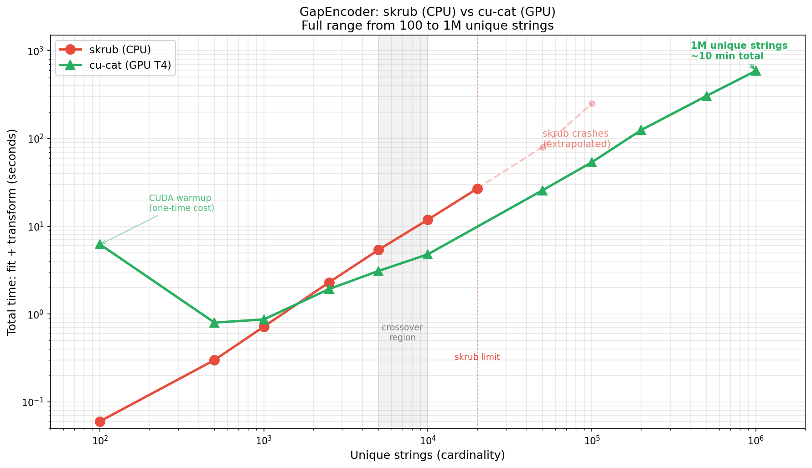
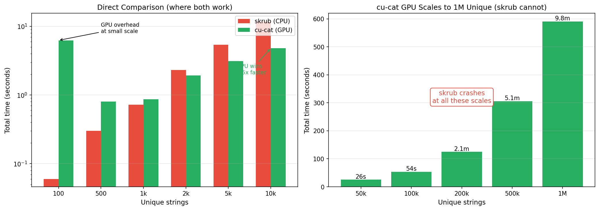

# **cu-cat** 


****cu-cat**** is an end-to-end gpu Python library that encodes
categorical variables into machine-learnable numerics. It is a cuda
accelerated port of what was dirty_cat, now rebranded as
[skrub](https://github.com/skrub-data/skrub), and allows more ambitious interactive analysis & real-time pipelines!

[Loom video walkthru](https://www.loom.com/share/d7fd4980b31949b7b840b230937a636f?sid=6d56b82e-9f50-4059-af9f-bfdc32cd3509)

# What can **cu-cat** do?

The latest PyGraphistry[AI] release GPU accelerates to its automatic feature encoding pipeline, and to do so, we are delighted to introduce the newest member to the open source GPU dataframe ecosystem: cu_cat! 
The Graphistry team has been growing the library out of need. The straw that broke the camel’s back was in December 2022 when we were hacking on our winning entry to the US Cyber Command AI competition for automatically correlating & triaging  gigabytes of alerts, and we realized that what was slowing down our team's iteration cycles was CPU-based feature engineering, basically pouring sand into our otherwise humming end-to-end GPU AI pipeline. Two months later, cu_cat was born. Fast forward to now, and we are getting ready to make it default-on for all our work.

Hinted by its name, cu_cat is our GPU-accelerated open source fork of the popular CPU Python  library dirty_cat.   Like dirty_cat, cu_cat makes it easy to convert messy dataframes filled with numbers, strings, and timestamps into numeric feature columns optimized for AI models. It adds interoperability for GPU dataframes and replaces key kernels and algorithms with faster and more scalable GPU variants. Even on low-end GPUs, we are now able to tackle much larger datasets in the same amount of time – or for the first time! – with end-to-end pipelines. We typically save time with **3-5X speedups and will even see 10X+**, to the point that the more data you encode, the more time you save!

# What can **cu-cat** NOT do?

Since **cu_cat** is limited to CUDF/CUML dataframes, it is not a drop-in replacement for dirty_cat.  While it can also fallback to CPU, it is also not a drop-in replacement for the CPU-based dirty_cat, and we are not planning to make it one.  We developed this library to accelerate our own **graphistry** end-to-end pipelines, and as such it is only `TableVectorizer` and `GapEncoder` which have been optimized to take advantage of a GPU speed boost.

Similarly, **cu_cat** requires pandas or cudf input numpy array can be featurized but cannot be UMAP-ed since they lack index, and are thus not supported.

# What degree of speed boost can I expect with **cu-cat**, compared to dirty-cat or similar CPU feature encoders?

We have routinely experienced boosts of 2x on smaller datasets to 10x and more as one scales data into millions of features (features roughly equates to unique elements in rows x columns). One can observe this in the video above, demonstrated in the following plots:

There is an inflection point when overhead of transing data to GPU is offset by speed boost, as we can see here. The axis represent unique features being inferred.


As we can see, with scale the divergence in speed is obvious.


However, this graph does not mean to imply the trend goes on forever: **cu-cat** is single GPU, and each dataset, GPU, and GPU memory budget is unique, so these plots are meant merely for demonstrative purposes.

# Larger-than-memory datasets

`GapEncoder` works on the *unique* strings in a column, so row count matters far less than cardinality. Two levers cover the cases where a dataset still does not fit:

**Chunked fitting with `partial_fit`.** Peak memory is set by the chunk rather than by the whole input:

```python
from cu_cat import GapEncoder

enc = GapEncoder(n_components=10, hashing=True)
for chunk in pd.read_csv("huge.csv", chunksize=1_000_000):
    enc.partial_fit(chunk[["dirty_column"]])
encoded = enc.transform(df[["dirty_column"]])
```

**Narrow the hash width when cardinality is high.** The dominant GPU allocation during fitting is the dense `H @ W` term, which costs `n_unique * hashing_n_features * 8` bytes with a few copies live at once. It scales with the number of *distinct* strings and with the vocabulary width, not with row count, so halving the width halves the peak. Measured on a Colab T4 (15 GB), 1M rows over 200,000 distinct strings:

| `hashing_n_features` | fit time |
|---|---|
| 4096 (default) | does not fit; falls back to chunked updates and becomes impractically slow |
| 1024 | 17.2 s |
| 512 | 14.1 s |

As a rule of thumb, keep `n_unique * hashing_n_features * 24` bytes under your free GPU memory. If you exceed it, cu-cat automatically chunks the updates to stay within budget rather than raising an out-of-memory error, but narrowing the width is far faster than relying on that fallback.

**What happens when GPU memory runs out.** cu-cat degrades rather than failing:

1. Block size is derived from free GPU memory before fitting starts, so the dense term is kept inside the budget.
2. Free memory is only an estimate, so if a whole-matrix update still hits a CUDA out-of-memory error, the fit drops to blocks and continues.
3. If an individual block cannot fit either, it is halved and retried.
4. Only when a block at the minimum size still fails does it raise, and the error names the levers that help: lower `hashing_n_features`, fewer distinct values per call via `partial_fit`, or a larger GPU.

Measured on a T4 with a deliberately optimistic budget (1M rows, 200k distinct strings, an estimate claiming 19.5 GB fits in 14 GB): the fit recovers and completes in 31.1s, against 30.3s when the budget is correct from the start.

**Comparison with skrub.** skrub is the maintained successor to dirty_cat. With matched parameters (hashing=True, n_components=10, max_iter=5):



| Unique strings | skrub (CPU) | cu-cat (GPU T4) | Winner |
|----------------|-------------|-----------------|--------|
| 100 | 0.06s | 6.2s | skrub (GPU has CUDA warmup) |
| 1,000 | 0.7s | 0.9s | ~equal |
| 5,000 | 5.4s | 3.1s | **GPU 1.7x** |
| 10,000 | 11.9s | 4.8s | **GPU 2.5x** |
| 50,000 | CRASH | 26s | GPU only |
| 100,000 | CRASH | 54s | GPU only |
| 500,000 | CRASH | 5.1 min | GPU only |
| 1,000,000 | CRASH | 9.8 min | GPU only |



**Key insight:** GPU has overhead at tiny scale but wins at 5k+ unique strings. Beyond 20k unique, skrub crashes entirely while cu-cat GPU continues scaling to 1M+ unique strings.

dirty_cat (the predecessor) has not been updated for pandas ≥2.2.

**`hashing=True` for unbounded cardinality.** The default `CountVectorizer` learns a vocabulary, so it must see all unique strings at once and it freezes that vocabulary on the first `partial_fit` chunk. `HashingVectorizer` (`hashing=True`) is stateless with a fixed `hashing_n_features` width, so it needs no vocabulary pass and stays a constant size no matter how many distinct strings arrive. That makes it the right choice when the number of *distinct* values, not the number of rows, is what exceeds GPU memory.

GPU = colab T4 + 15gb mem and colab CPU + 12gb memory


## Startup Code demonstrating speedup:

    ! pip install cu-cat dirty-cat
    from time import time
    from cu_cat._table_vectorizer import TableVectorizer as cu_TableVectorizer
    from dirty_cat._table_vectorizer import TableVectorizer as dirty_TableVectorizer
    from sklearn.datasets import fetch_20newsgroups
    n_samples = 2000  # speed boost improves as n_samples increases, to the limit of gpu mem

    news, _ = fetch_20newsgroups(
        shuffle=True,
        random_state=1,
        remove=("headers", "footers", "quotes"),
        return_X_y=True,
    )

    news = news[:n_samples]
    news=pd.DataFrame(news)
    table_vec = cu_TableVectorizer()
    t = time()
    aa = table_vec.fit_transform((news))
    ct = time() - t
    # if deps.dirty_cat:
    t = time()
    bb = dirty_TableVectorizer().fit_transform(news)
    dt = time() - t
    print(f"cu_cat: {ct:.2f}s, dirty_cat: {dt:.2f}s, speedup: {dt/ct:.2f}x")
    >>> cu_cat: 58.76s, dirty_cat: 84.54s, speedup: 1.44x
## Enhanced Code using Graphistry:

    # !pip install graphistry[ai] ## future releases will have this by default
    !pip install git+https://github.com/graphistry/pygraphistry.git@dev/depman_gpufeat

    import cudf
    import graphistry
    df = cudf.read_csv(...)
    g = graphistry.nodes(df).featurize(feature_engine='cu_cat')
    print(g._node_features.describe()) # friendly dataframe interfaces
    g.umap().plot() # ML/AI embedding model using the features


## Example notebooks 

[Hello cu-cat notebook](https://github.com/dcolinmorgan/grph/blob/main/Hello_cu_cat.ipynb) goes in-depth on how to identify and deal with messy data using the **cu-cat** library.

**CPU v GPU Biological Demos:**
- Single Cell analysis [generically](https://github.com/dcolinmorgan/grph/blob/main/single_cell_umap_before_gpu.ipynb) and Single Cell analysis [accelerated by **cu-cat**](https://github.com/dcolinmorgan/grph/blob/main/single_cell_after_gpu.ipynb)

- Chemical Mapping [generically](https://github.com/dcolinmorgan/grph/blob/main/generic_chemical_mappings.ipynb) and Chemical Mapping [accelerated with **cu-cat**](https://github.com/dcolinmorgan/grph/blob/main/accelerating_chemical_mappings.ipynb)

- Metagenomic Analysis [generically](https://github.com/dcolinmorgan/grph/blob/main/generic_metagenomic_demo.ipynb) and Metagenomic Analysis [accelerated with **cu-cat**](https://github.com/dcolinmorgan/grph/blob/main/accelerating_metagenomic_demo.ipynb)


## Dependencies

Major dependencies the cuml and cudf libraries, as well as [standard
python
libraries](https://github.com/skrub-data/skrub/blob/main/setup.cfg)

# Related projects

dirty_cat is now rebranded as part of the sklearn family as
[skrub](https://github.com/skrub-data/skrub)


